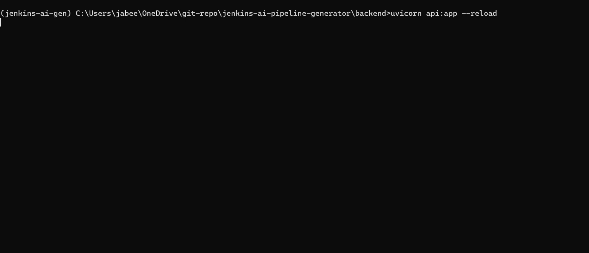
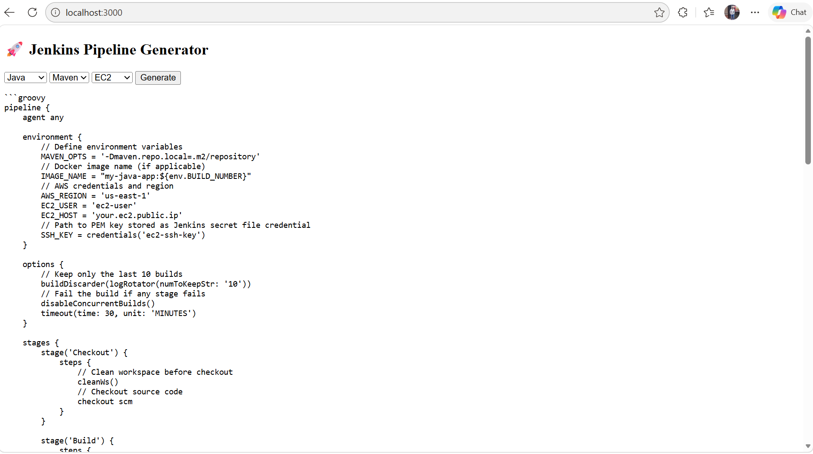

# Windows PC

# 💻 Local Setup Guide – AI Jenkins Pipeline Generator

This guide will help you run the backend and frontend locally before deploying to AWS.

---

## 🧱 Prerequisites

Make sure you have the following installed:

* Python (3.9 – 3.11 recommended)
* Git
* (Optional) Docker

Verify installations:

```bash
python --version
git --version
docker --version
```

---

## 📁 Clone the Repository

```bash
git clone https://github.com/your-username/jenkins-ai-pipeline-generator.git
cd jenkins-ai-pipeline-generator
```

---

## 🧪 Backend Setup

### Step 1: Navigate to Backend Directory ⚠️

```bash
cd backend
```

> ⚠️ IMPORTANT: You **must be inside the `backend/` directory** where `api.py` exists before running the server.
> Otherwise, `uvicorn` will fail to start.

---

### Step 2: Create Virtual Environment

```bash
python -m venv jenkins
```

Activate:

**Windows:**

```bash
jenkins\Scripts\activate
```

**Mac/Linux:**

```bash
source jenkins/bin/activate
```

---

### Step 3: Install Dependencies

```bash
pip install -r requirements.txt
```

---

### Step 4: Set OpenAI API Key

**Windows (PowerShell):**

```bash
setx OPENAI_API_KEY "your_api_key_here"
```

Restart your terminal after setting this.

**How to Create Your OpenAI API Key**
1. Go to the OpenAI Platform (https://platform.openai.com)
2. Sign in or Create an Account
    * Click your profile icon (top-right)
    * Select View API Keys
    * Click Create new secret key
3. Navigate to API Keys
4. Click Create new secret key
5. Copy and Store Your Key Safely(Never share your API key publicly (GitHub, screenshots, etc.).)


---

### Step 5: Run Backend Server

```bash
uvicorn api:app --reload
```

You should see:

```
Uvicorn running on http://127.0.0.1:8000
```

# Output
## 🎬 Demo Video
[](images/Local_Setup_Output.mp4)

## 🖼️ Sample Output Screenshot

---

## 🌐 Test the API

### Swagger UI (Recommended)

Open in browser:

```
http://127.0.0.1:8000/docs
```

Use `/generate` endpoint with:

```json
{
  "language": "Node.js",
  "build_tool": "npm",
  "deployment": "Docker"
}
```

---

## 🖥️ Frontend Setup

```bash
cd ../frontend
```

Open `index.html` and update API URL:

```javascript
http://127.0.0.1:8000
```

Run this using Python:

```
python -m http.server 3000
```

Now Open browser:
```
http://localhost:3000
```

---

## 🐳 (Optional) Run with Docker

From `backend/` folder:

```bash
docker build -t jenkins-ai .
docker run -p 9000:8080 -e OPENAI_API_KEY=your_key jenkins-ai
```

Test:

```bash
curl -XPOST "http://localhost:9000/2015-03-31/functions/function/invocations" \
-d '{"language":"Node.js","build_tool":"npm","deployment":"Docker"}'
```

---

# ⚠️ Common Issues & Fixes

---

### ❌ 1. `FastAPI` installation failed

**Error:**
If you encounter this error:
```
ERROR: Could not find a version that satisfies the requirement fastapi==0.110.0 (from versions: none)
ERROR: No matching distribution found for fastapi==0.110.0
```
The root cause is almost always Python version incompatibility.
In my case, I was using Python 3.12.x, which FastAPI 0.110.x does not fully support yet.

FastAPI 0.110.x requires:
    * Python 3.8 – 3.12 (based on FastAPI + Starlette + Pydantic compatibility)

**Fix:**

* Download the official Windows installer for Python 3.11 from python.org
* During Installation, 
    * Check the box: Add Python 3.11 to PATH
    * Click Install Now
* Verify if it's installed or not
    ```
    python3.11 --version
    ```

---

### ❌ 1. `uvicorn` not working

**Error:**

```
'uvicorn' is not recognized
```

**Fix:**

```bash
pip install uvicorn
```

---

### ❌ 2. Running from wrong directory

**Error:**

```
Error loading ASGI app. Could not import module "api"
```

**Fix:**

```bash
cd backend
uvicorn api:app --reload
```

> ✅ You must run `uvicorn` from the folder where `api.py` exists.

---

### ❌ 3. OpenAI API key not working

**Fix:**

* Restart terminal after `setx`
* Or temporarily set:

```bash
set OPENAI_API_KEY=your_key
```

---

### ❌ 4. Port already in use

**Fix:**

```bash
uvicorn api:app --reload --port 8001
```

---

### ❌ 5. Module not found errors

**Fix:**
Make sure virtual environment is activated:

```bash
jenkins\Scripts\activate
```

Then reinstall:

```bash
pip install -r requirements.txt
```

---

### ❌ 6. Slow response / timeout

**Fix:**

* Check internet connection
* Verify OpenAI API key
* Try smaller request

---

## ✅ Success Checklist

You are ready for AWS deployment when:

* Backend runs without errors
* `/docs` page loads
* `/generate` API returns Jenkinsfile
* Frontend connects successfully

---

## 🚀 Next Step

Proceed to AWS deployment using:

* Manual steps (ECR + Lambda + API Gateway)
* Terraform (in `/terraform` folder)

---
